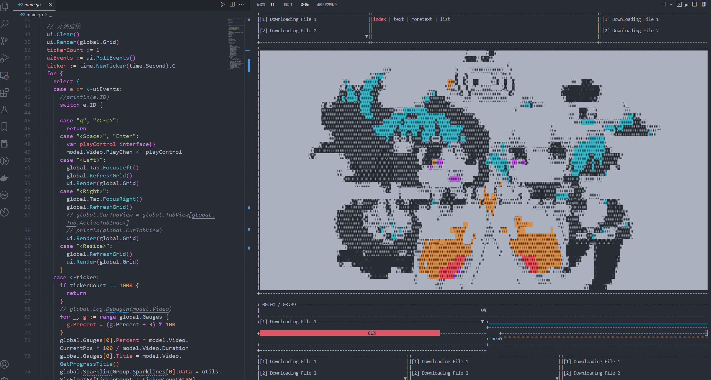

# BiliBili-Terminal



> 本项目长期维护~目前仅开发分支
> 
> 等待V 1.x.x版本应该才是可以使用的
>


## ChangeLog
> **feat** 新功能、**fix** 修补 bug、**docs** 文档、**style** 格式、**refactor** 重构、**test** 增加测试、**chore** 构建过程、辅助工具、**perf** 提高性能
>
> - [v.0.0.5版本b站视频演示](https://www.bilibili.com/video/BV1844y1d7Eg/?spm_id_from=333.999.0.0)

> 后面预期【0.0.6 配置和日志】、【0.0.7 首页布局制作&音频同步视频】、【0.0.8 封装视频组件】

| Date      | Versiton | Describe |Changelog                                  |
| --------- | -------- | -------- |------------------------------------------ |
| 2023.01.01 | v0.0.6   | viper读取配置、封装页面组件~ |  🚀 **[feat]** 【viper读取配置】/【log日志输出到窗口组件】/【封装page组件更为优雅】 |
| 2022.12.29 | v0.0.5   | 支持中文！修复部分bug~ |  🚀 **[fix]** 【修复中文显示】/【修复结束不能重新播放】 |
| 2022.12.29 | v0.0.4   | 支持bv解析了~ |  🚀 **[feat]** 【bv解析播放！】/【加载进度条】 |
| 2022.12.29 | v0.0.3   | 支持音频了~ |  ☀️ **[perf]** 优化播放逻辑 <br/>💬 **[fix]** 修复线上问题及添加gitignore  <br/>🚀 **[feat]** 【支持音频播放！】/【同步拉取图片及音频】/ 【初步实现音视频同步播放】   |
| 2022.12.28 | v0.0.2   | 优化架构，优化播放  | 📺 **[refactor]** 重构项目框架<br/>☀️ **[perf]** 优化播放逻辑 <br/>📑 **[docs]** 更新README文档  <br/>🚀 **[feat]** 【实现响应式布局】/【实现进度条】/ 【实现预加载播放】   |
| 2022.12.27  | v0.0.1   | 页面布局、支持视频播放  |  📺 **[init]** 初始化界面<br/>🚀 **[feat]** 完成页面布局 <br/>🚀 **[feat]** 实现视频播放  |


## Features`V0.0.6`
> **系统进度** `[==>20%------------------------]` 
> **设计进度** `[========>35%------------------]` 

* [x] 命令行播放视频
* [x] 音频播放
* [x] 直接解析bv `go run main.go -b BV1xx411c79H` 
* [x] 完成组件构建
* [x] viper读取本地配置
* [ ] 日志收集器
* [ ] 弹幕解析 
* [ ] ...


## Build
> 1. **运行环境需要【[ffmpeg](https://juejin.cn/post/6992181270960685086)】**：命令行输入ffmpeg有输出即可
> 
> 2. **编译环境需要【golang】**：我的是go1.9.4，理论上都行

(win推荐使用[choco](https://juejin.cn/post/7009855843260710948)，任何环境直接`choco install xxx`搞定，完全不需要自己动手下载和配置环境变量)
```bash
# mod load
$ go mod tidy
# r启动
$ go run main.go
# 打包
$ go build main.go
```
## 架构逻辑

```
├───core          服务组件(viper、zap)
├───ffmpeg        视频抽帧音频分离逻辑
├───global        全局变量或者服务
├───output        输出内容
│   ├───audio         分割的音频
│   ├───img           分割的图片
│   └───video         处理的视频
├───resource      资源目录
│   ├───images        本地图片(封面，视频暂停ui等)
│   └───doc           readme里面的图片
├───utils         工具
└───view          页面视图
└───main.go       主程序
└───config.yaml   配置文件

```
1. 主程序负责启动项目
```
// 初始化页面逻辑
Init()

// 开始渲染
for {
  select {
  // 判断事件，然后系统事件这里处理
  case e := <-ui.PollEvents():
    //println(e.ID)
    switch e.ID {
    case "q", "<C-c>":
      return
    // 页面事件交给页面处理
    case "<Resize>":
      view.NowPage.Refresh()
    default:
      view.NowPage.EventHander(e)
  }
}

```

2. 页面组件封装
> 抽象页面组件，不同的页面只要实现【刷新】【关闭】【事件处理器】就可以了，main程序会负责分发

```
type Page interface {
	Refresh()
	Close()
	EventHander(e termui.Event)
}
```

3. 视频page举例子
> 视频页面封装了 termui的组件和视频内容通用熟悉，以及b站视频相关

```
type VideoPage struct {
	video.VideoDetail
	Gauge      *widgets.Gauge
	List       *widgets.List
	Tab        *widgets.TabPane
	TabView    []interface{}
	Grid       *ui.Grid
	CurTabView interface{}
}
```
- VideoDetail包括Img组件和进度条组件，同时提供如下方法
  - Init() : 初始化
  - DownLoad(): 解析bv号拿到下载链接并下载或者在线预览
  - Load()：根据currentPos当前进度获取preload设定的缓存秒数后面的内容
- VideoPage会启动一个视频播放线程，同时自己本身会响应主线程发来的事件

##  TODO

**近期**
1. 缓存视频再播放
2. 自定义日志,日志可以输出到面板
3. 对接音频
4. 继续重构架构


**后期**

1. 对接b站api
2. 对接弹幕

**已完成**
1. ffmpeg 获取视频长度，做个进度条 
2. 让视频刷新更快
3. 尝试先缓存视频到本地再播放
4. 包装ffmpeg出来
二期
1. 记录播放上次时间
2. 根据resize设置不同的布局 长宽比小于1 就是手机layout 大于1就是电脑布局
## Bugs
> qwq


* [ ] P0:暂不支持中文(win)
* [ ] P1:音视频不同步
* [ ] p1:视频结束没出现结束界面及重新播放失效
* [ ] P2:音频转换卡顿
* [ ] P3:go 线程管理不到位，小概率卡死
* [ ] ...


## Dependence


- github.com/gizak/termui/v3 **Go命令行UI组件库**
- github.com/hajimehoshi/go-mp3  **音频播放组件**
- github.com/hajimehoshi/oto/v2 **音频播放组件**
- go.uber.org/zap **高性能日志库zap**

---
- https://github.com/iawia002/lux 参考项目
- https://www.zhaoyanbai.com/articles/BilibiliGolangDownloader Go哔哩哔哩下载器

## 备注

- 后期把resource里面被项目引用的图片都转成base64存放
  - 目前策略是读取不到resource就读取默认本地base64
  - resource文件夹不会被打包的exe携带，最好用base64存放icon

## License

* [MIT](https://github.com/404name/bilibili-terminal/blob/master/LICENSE)

## Copyright

* **Author:** [404name](https://github.com/404name)
* **AboutMe:** [here](https://yuque.com/404name)
